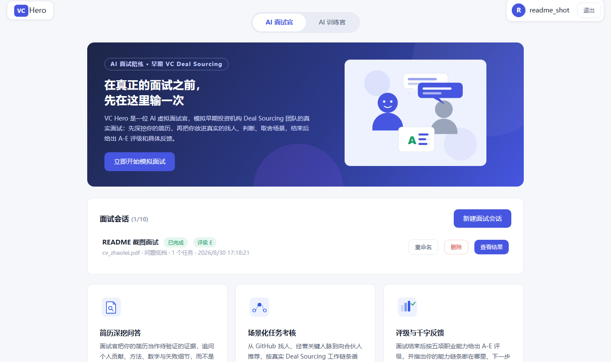
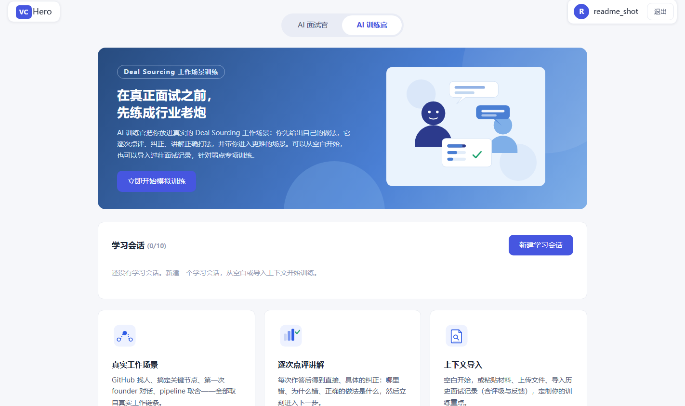
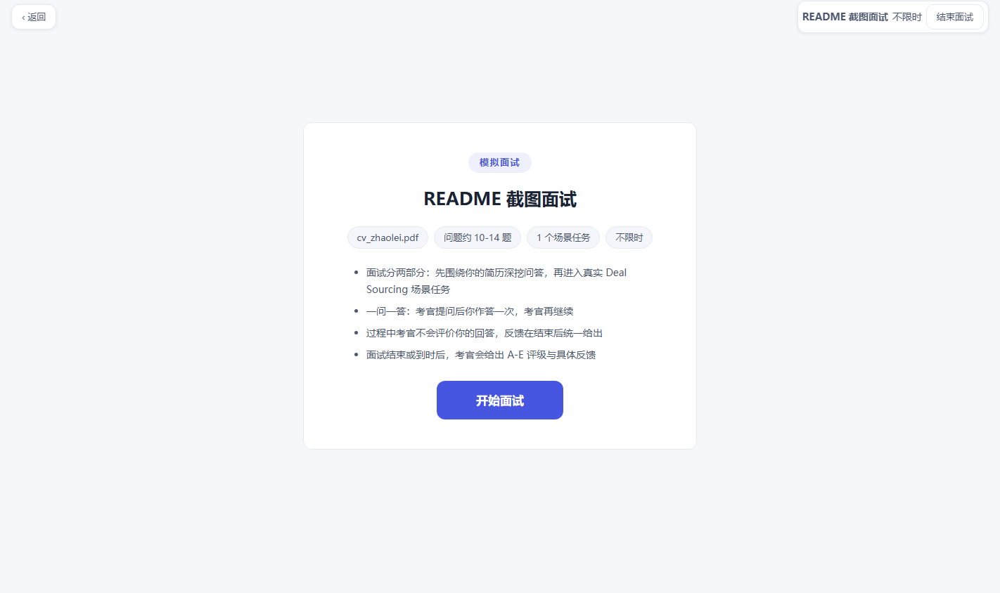
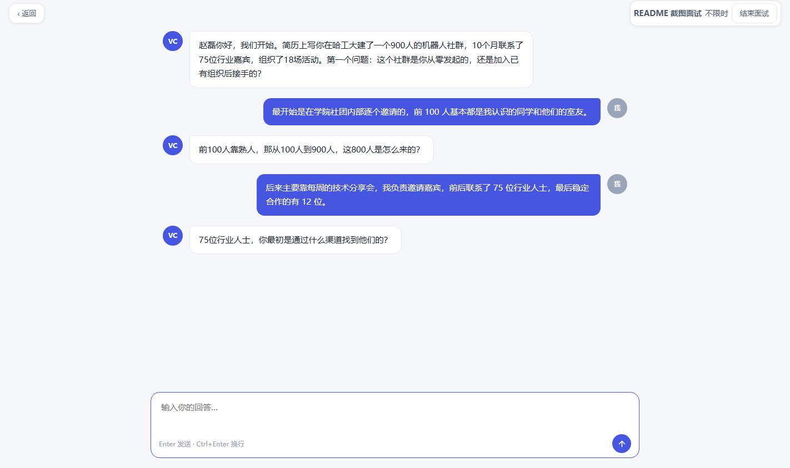
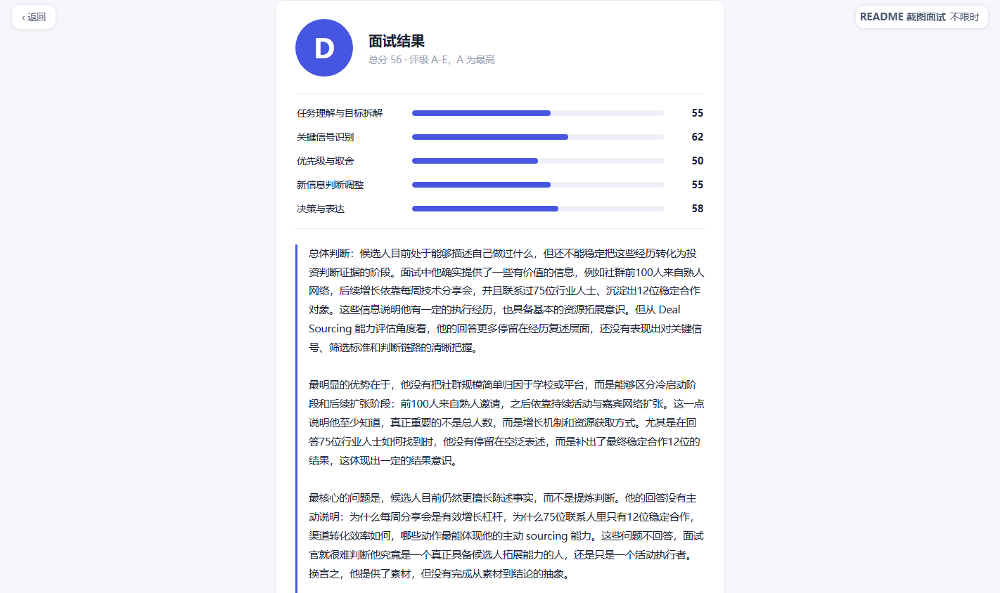

# VC Hero — AI 虚拟面试官 · 早期 VC Deal Sourcing 面试陪练

一个模拟早期投资机构 Deal Sourcing 团队真实面试的陪练网站：AI 面试官先深挖你的简历，再把你放进真实的找人、判断、取舍场景，结束后给出 A-E 评级与具体反馈；AI 训练官则带你逐场景训练工作打法，针对弱点专项提升。

线上地址：http://152.136.60.146

## 界面一览

| AI 面试官主页 | AI 训练官主页 |
|---|---|
|  |  |

| 考试开始页 | 面试对话（深挖追问） |
|---|---|
|  |  |

| 面试结果（评级 + 五维评分 + 千字反馈） |
|---|
|  |

## 功能

**AI 面试官（面试陪练）**
- 账号系统：免验证注册，个人信息设置，PDF 简历上传（≤5 份、每份 ≤10MB，服务端抽取纯文本）
- 面试会话管理：新建 / 重命名 / 删除（≤10 个），可选简历、问题数量档位（低/中/高，区间内具体题数由模型决定）、任务数量（1-5）、时长限制
- 两阶段面试：简历深挖问答（约 10-45 题，模型自行收尾）→ Deal Sourcing 场景任务（建会话时随机抽取）
- 压力面风格：严肃直接、质疑矛盾、追问到具体动作和数字
- 结束后按五项能力评分，给出 A-E 评级和 500-1000 字结构化反馈

**AI 训练官（场景训练）**
- 把学员放进真实工作场景：学员先给出做法，训练官逐次点评对错、讲解正确打法、推进更难场景
- 上下文可选：空白开始 / 粘贴文本 / 上传文件（PDF·TXT·MD·DOCX）/ 导入历史面试记录（含对话与评分反馈）/ 勾选已上传简历
- 随时结束生成训练总结（进步、问题、下一步训练建议）

**工程特性**
- Kimi API（kimi-k3，关闭推理 + temperature 0.6，单轮 5-12 秒）
- 面试官每条回复经"生成 → 恰好 2 轮自我迭代"后才发出
- 全局限速：一小时滑动窗口内 token/h、response/h、每小时成本上限（¥5，保守偏高计价）三闸口；全部用户 FIFO 公平队列负载均衡
- 会话页服务端渲染首屏；静态资源版本号防缓存；HTML no-store

## 技术栈

Flask + 原生 HTML/CSS/JS（单页应用 + Jinja 服务端渲染），本地文件系统存储（无数据库），prompts 全部以 Markdown 存于 `prompts/`（后端零硬编码提示词）。

## 目录结构

```
app.py                  # 启动入口（PORT/HOST 环境变量可覆盖）
vc_hero/                # Flask 后端包
  config.py             #   全部配置（配额、模型、档位区间等）
  storage.py            #   文件系统存储（用户/令牌/简历/会话）
  pdfutil.py            #   PDF/TXT/MD/DOCX 文本抽取
  ratelimit.py          #   滑动窗口限速 + FIFO 公平队列
  kimi.py               #   Kimi 客户端（2 轮自我迭代、429 退避）
  interview.py          #   面试引擎（状态机 + [[CV_DONE]] 收尾标记）
  training.py           #   训练官引擎（自由回合 + 训练总结）
  routes.py             #   REST API（按 kind 分发到对应引擎）
prompts/                # 全部提示词（含三个原始规则 md + 总控/自检/评分/场景库）
static/                 # 前端单页应用 + SVG 插图
templates/              # 服务端渲染模板（index / 会话首屏）
tests/                  # smoke_test（stub 全流程 32 项）/ real_flow_test / deploy
版本迭代记录.md          # append only 的变更日志
```

## 本地运行

```bash
pip install flask pypdf
echo "<your-kimi-key>" > kimi_api_key.txt
python app.py            # http://localhost:5000
```

## 测试与部署

```bash
python tests/smoke_test.py     # 冒烟测试（stub 替换 LLM，不消耗额度）
python tests/real_flow_test.py # 真实 LLM 全流程（消耗 API 额度）
python tests/deploy.py         # 打包上传服务器并重启（paramiko）
```

服务器（Ubuntu）：代码在 `/opt/vc_hero`，venv 隔离依赖，80 端口（`cap_net_bind_service`），`nohup` 运行，日志 `server.log`。

## 常用配置调节

`vc_hero/config.py`：`COST_CAP_PER_HOUR_CNY` / `TOKEN_CAP_PER_HOUR` / `RESPONSE_CAP_PER_HOUR`（限速三闸口）、`LEVEL_RANGES`（低/中/高题量区间）、`KIMI_MODEL` / `KIMI_THINKING`（模型与推理开关）、`SELF_REVIEW_ROUNDS`（自我迭代轮数）。

变更历史见 [版本迭代记录.md](版本迭代记录.md)。
